# Documentation - 自助售酒机小程序端

## 📖 Overview

Welcome to the comprehensive documentation for the **Self-Service Wine Vending Machine Mini-Program** (自助售酒机小程序端). This documentation provides complete information about all public APIs, functions, components, development practices, and usage instructions.

## 🚀 Quick Start

### For Developers
1. Read the [Development Guide](./DEVELOPMENT_GUIDE.md) to set up your environment
2. Review the [API Documentation](./API_DOCUMENTATION.md) for available services
3. Check the [Component Documentation](./COMPONENT_DOCUMENTATION.md) for UI components
4. Follow the [Testing Guide](./TESTING_GUIDE.md) for quality assurance

### For Users
1. Scan QR code on wine vending machine
2. Login with phone number and SMS verification
3. Select desired wine products
4. Complete payment via WeChat Pay or Alipay
5. Collect your order from the machine

## 📚 Documentation Structure

### 🔧 [API Documentation](./API_DOCUMENTATION.md)
Comprehensive documentation for all public APIs, functions, and services.

**Includes:**
- Authentication APIs (`auth.login`, `auth.logout`)
- Machine Management APIs (`machine.getMachineInfo`, `machine.scanQRCode`)
- Product Management APIs (`product.getProductList`, `product.getProductDetail`)
- Order Management APIs (`order.createOrder`, `order.getOrderHistory`)
- Payment APIs (`payment.initiatePayment`, `payment.verifyPayment`)
- Utility Functions (`formatPrice`, `validatePhone`, `generateOrderId`)

**Key Features:**
- ✅ Complete parameter documentation
- ✅ Response format examples
- ✅ Error handling patterns
- ✅ Usage examples for all APIs

### 🎨 [Component Documentation](./COMPONENT_DOCUMENTATION.md)
Detailed documentation for all UI components used in the mini-program.

**Component Categories:**
- **Core Components**: `<App />`, `<PageContainer />`
- **Layout Components**: `<Header />`, `<TabBar />`, `<Grid />`
- **Form Components**: `<LoginForm />`, `<PhoneInput />`, `<QuantitySelector />`
- **Display Components**: `<ProductCard />`, `<MachineInfo />`, `<OrderCard />`
- **Navigation Components**: `<BackButton />`, `<NavigationMenu />`
- **Utility Components**: `<LoadingSpinner />`, `<Toast />`, `<QRScanner />`

**Features:**
- ✅ Props documentation for each component
- ✅ Usage examples with code snippets
- ✅ Styling guidelines and themes
- ✅ Accessibility best practices

### 🛠️ [Development Guide](./DEVELOPMENT_GUIDE.md)
Complete guide for developing, building, and maintaining the mini-program.

**Sections:**
- **Project Setup**: Prerequisites, installation, environment configuration
- **Development Environment**: WeChat Developer Tools setup
- **Project Structure**: File organization and naming conventions
- **Development Workflow**: Feature development, testing, deployment
- **Coding Standards**: JavaScript, WXML, WXSS guidelines
- **Building and Deployment**: Production builds, CI/CD pipeline
- **Troubleshooting**: Common issues and solutions

**Features:**
- ✅ Step-by-step setup instructions
- ✅ Best practices and coding standards
- ✅ CI/CD pipeline configuration
- ✅ Troubleshooting guide

### 🧪 [Testing Guide](./TESTING_GUIDE.md)
Comprehensive testing strategies, tools, and best practices.

**Testing Types:**
- **Unit Testing**: Functions, utilities, component logic (90%+ coverage)
- **Integration Testing**: Component integration, API integration
- **End-to-End Testing**: Critical user journeys, full system integration
- **Performance Testing**: Load testing, memory usage monitoring
- **Security Testing**: Input validation, authentication security

**Features:**
- ✅ Testing pyramid strategy
- ✅ Jest and testing framework setup
- ✅ Mock data and fixtures
- ✅ CI/CD integration for automated testing

## 🏗️ Project Architecture

### Technology Stack
- **Framework**: WeChat Mini Program
- **Language**: JavaScript ES6+
- **Styling**: WXSS (WeChat Style Sheets)
- **State Management**: Page-level data binding
- **API Communication**: WeChat Request API
- **Payment**: WeChat Pay integration

### Core Features
1. **User Authentication**: Phone + SMS verification
2. **Machine Integration**: QR code scanning for machine identification
3. **Product Catalog**: Browse available wines with real-time stock
4. **Order Management**: Create, track, and manage orders
5. **Payment Processing**: WeChat Pay and Alipay integration
6. **User Profile**: Order history and account management

## 🔄 User Flow

```mermaid
graph TD
    A[用户打开小程序] --> B[扫描机器二维码]
    B --> C[登录/注册]
    C --> D[选择酒品]
    D --> E[确认订单]
    E --> F[支付]
    F --> G[机器出货]
    G --> H[订单完成]
```



## 🛡️ Security Features

- **Input Validation**: All user inputs are validated and sanitized
- **Authentication**: JWT-based token authentication
- **Payment Security**: PCI-compliant payment processing
- **Data Protection**: Sensitive data encryption
- **API Security**: Rate limiting and request validation

## 📊 API Overview

### Authentication Endpoints
```
POST /auth/login          - User login with phone/SMS
POST /auth/logout         - User logout
GET  /auth/profile        - Get user profile
```

### Machine Endpoints
```
GET  /machines/{id}       - Get machine information
GET  /machines/{id}/products - Get machine products
POST /machines/scan       - Process QR scan result
```

### Order Endpoints
```
POST /orders              - Create new order
GET  /orders/{id}         - Get order details
GET  /orders              - Get user order history
PUT  /orders/{id}         - Update order status
```

### Payment Endpoints
```
POST /payments/initiate   - Initiate payment
POST /payments/verify     - Verify payment status
GET  /payments/{id}       - Get payment details
```

## 🎯 Component Hierarchy

```
App
├── Pages
│   ├── Index (Home)
│   ├── Login
│   ├── Products
│   ├── Order
│   ├── Payment
│   └── Profile
├── Components
│   ├── MachineScanner
│   ├── ProductCard
│   ├── OrderSummary
│   ├── PaymentModal
│   └── Common
│       ├── Header
│       ├── TabBar
│       ├── LoadingSpinner
│       └── Toast
└── Services
    ├── Auth
    ├── Machine
    ├── Product
    ├── Order
    └── Payment
```

## 🔧 Development Setup

### Prerequisites
- Node.js v16+
- WeChat Developer Tools
- Git

### Quick Setup
```bash
# Clone the repository
git clone https://github.com/your-org/sharedWineMachineMiniProgram.git

# Install dependencies
cd sharedWineMachineMiniProgram
npm install

# Start development
npm run dev
```

### Environment Configuration
```bash
# .env.local
MINI_PROGRAM_APP_ID=your_app_id
API_BASE_URL=https://api.example.com
WECHAT_PAY_MERCHANT_ID=your_merchant_id
```

## 📝 Code Examples

### Basic Authentication
```javascript
import { auth } from './services/auth';

// Login user
const result = await auth.login({
  phone: '13800138000',
  code: '123456'
});

if (result.success) {
  console.log('Login successful:', result.user);
}
```

### Product Selection
```javascript
import { product } from './services/product';

// Get products for a machine
const products = await product.getProductList('WM001');

// Select a product
const selectedProduct = products.find(p => p.id === 'P001');
```

### Order Creation
```javascript
import { order } from './services/order';

// Create order
const newOrder = await order.createOrder({
  machineId: 'WM001',
  productId: 'P001',
  quantity: 1
});

console.log('Order created:', newOrder.id);
```

## 🚀 Deployment

### Production Build
```bash
npm run build:prod
```

### WeChat Mini Program Deployment
1. Upload via WeChat Developer Tools
2. Submit for review
3. Release to production

## 📈 Performance Metrics

- **Load Time**: < 2 seconds
- **API Response**: < 500ms average
- **Memory Usage**: < 50MB
- **Bundle Size**: < 2MB

## 🔍 Testing Coverage

- **Unit Tests**: 90%+ coverage
- **Integration Tests**: Critical paths covered
- **E2E Tests**: Key user flows verified
- **Performance Tests**: Load and stress testing
- **Security Tests**: Vulnerability assessments

## 📞 Support

### Development Support
- **Documentation**: Complete guides and API references
- **Code Examples**: Real-world usage examples
- **Best Practices**: Industry-standard development practices

### Contact Information
- **Email**: dev-support@example.com
- **GitHub**: [Issues](https://github.com/your-org/issues)
- **WeChat Group**: Development support group

## 📄 License

This project is licensed under the MIT License - see the [LICENSE](../LICENSE) file for details.

## 🤝 Contributing

We welcome contributions! Please see our [Contributing Guide](./CONTRIBUTING.md) for details on:
- Code of conduct
- Development process
- Pull request guidelines
- Issue reporting

## 📋 Changelog

### Version 1.0.0 (Latest)
- ✅ Initial release
- ✅ Core functionality implemented
- ✅ WeChat Pay integration
- ✅ Complete documentation

For detailed changes, see [CHANGELOG.md](./CHANGELOG.md).

---

## 📖 Quick Navigation

| Document | Description | Status |
|----------|-------------|---------|
| [API Documentation](./API_DOCUMENTATION.md) | Complete API reference with examples | ✅ Complete |
| [Component Documentation](./COMPONENT_DOCUMENTATION.md) | UI component library documentation | ✅ Complete |
| [Development Guide](./DEVELOPMENT_GUIDE.md) | Setup, workflow, and best practices | ✅ Complete |
| [Testing Guide](./TESTING_GUIDE.md) | Testing strategies and tools | ✅ Complete |

---

**📧 Questions?** Contact our development team at dev-support@example.com

**🐛 Found a bug?** Report it on our [GitHub Issues](https://github.com/your-org/issues)

**💡 Feature request?** We'd love to hear your ideas!